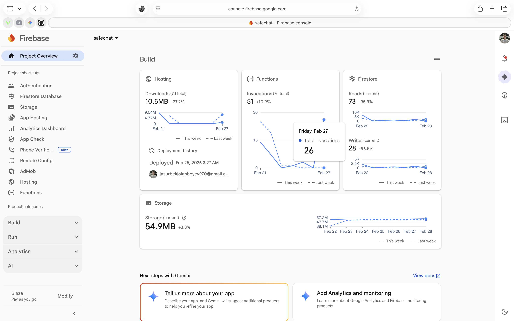

# 🚀 Cyber-Startup Community App

**Messenger + Startup Ecosystem + Cyber Security** — O'zbekiston yoshlari uchun kiberxavfsizlik madaniyati va innovatsion startuplarni birlashtiruvchi yagona ekotizim. 

Ushbu loyiha yosh startupperlarga o'z jamoasini yig'ish, loyihalarini ommalashtirish va kiber-gigiyena qoidalarini o'rganish uchun xavfsiz maydon yaratadi.

> ⚠️ **Muhim eslatma:** Ilovadagi har bir tugma va har bir interfeys to'liq ishchi holatda. Bu shunchaki vizual frontend emas, balki foydalanuvchilar real vaqtda foydalana oladigan funksional tizimdir. Loyiha va dastur kodi mualliflik huquqi bilan himoyalangan.

---

## 📺 MVP dan foydalanish (Video)
Ilovaning imkoniyatlari va ishlash jarayoni bilan tanishing:

> 🎥 **[YouTube orqali ko'rish](https://www.youtube.com/watch?v=aTdCIfk0Ui8)** | 📱 **[Telegram orqali ko'rish](https://t.me/hackerlaruchundasturlar/22)**

---

## 🛠 Texnologik Stack va Avtomatik Yangilanish
Loyiha eng zamonaviy texnologiyalar asosida qurilgan:

* **Backend (Cloud):** **Firebase** tizimi real-vaqt rejimida ma'lumotlarni sinxronizatsiya qiladi.
* **Hot Updates:** **Shorebird Code Push** integratsiyasi foydalanuvchilarga yangi funksiyalarni APK yuklamasdan avtomatik yetkazadi.

### ⚡️ Firebase Console (Backend boshqaruvi)
Ma'lumotlar xavfsizligi va foydalanuvchilar bazasi Firebase platformasi orqali real-vaqt rejimida boshqariladi:

  

---

## 🛡 Xavfsizlik va Ma'lumotlar yaxlitligi (Security & Integrity)
[cite_start]Loyiha kiberxavfsizlikning eng zamonaviy standartlari asosida qurilgan[cite: 1]:

* [cite_start]**AI Chat Input Filter:** Xabarlar real vaqtda Sun'iy Intellekt tomonidan skanerdan o'tkaziladi[cite: 3]. [cite_start]Bu phishing va malware tarqalishini xabar yuborilishidan oldin to'xtatadi[cite: 4].
* [cite_start]**Integrated Antivirus System:** Ilova ichiga o'rnatilgan antivirus modullari barcha yuklanayotgan fayllarni (PDF, APK, ZIP) avtomatik tekshiruvdan o'tkazadi[cite: 5].
* [cite_start]**DDoS va Spam Himoyasi:** Rate Limiting tizimi tizim barqarorligini ta'minlaydi[cite: 6, 7].
* [cite_start]**Geofencing & Fingerprinting:** GPS koordinatalari va noyob qurilma identifikatorlari orqali yolg'on ma'lumotlar va soxta akkauntlar bloklanadi[cite: 8, 9].
* [cite_start]**AI Moderation:** Zararli havolalarni avtomatik aniqlaydigan filtrlash tizimi[cite: 12].
* [cite_start]**Verification System:** Muhim jarayonlarda faqat "Verified" (tasdiqlangan) foydalanuvchilar ishtirok eta oladi[cite: 11].

## ✨ Innovatsion funksiyalar va Biznes Model
* [cite_start]**AI Companion (Hamfikr AI):** Startup g'oyalarini tahlil qiluvchi va jamoa topishda ko'maklashuvchi shaxsiy AI Mentor bot[cite: 15, 16].
* [cite_start]**Professional Profiles:** Tashkilotlar uchun maxsus funksiyalar (lokatsiya, rasmiy URL) va "Verified" nishonlari[cite: 18, 19].
* [cite_start]**Freemium Xizmatlar:** Postlarni "TOP"ga chiqarish (Boost) va premium kiber-kurslar[cite: 21, 22].

---

## 📸 Ilovadan lavhalar (Barcha 19 ta Screenshot)

### 👤 Profil va Shaxsiy kabinet

  
  
  
  
  

### 💬 Xavfsiz Messenjer va Guruhlar

  
  
  
  
  
  

### 📰 Yangiliklar, Lenta va Qidiruv

  
  
  
  

### 🛠 Kontent yaratish va Sozlamalar

  
  
  
  

---

## 🚀 Ilovani o'rnatish va sinab ko'rish (MVP)
Ushbu loyihaning tayyor MVP (Proof of Concept) talqinini darhol telefoningizga o'rnatib, real vaqtda sinab ko'rishingiz mumkin.

> 📥 **[Cyber-Startup_MVP.apk (Yuklab olish)](https://t.me/hackerlaruchundasturlar/22)**