# 🚀 Cyber-Startup Community App

**Messenger + Startup Ecosystem + Cyber Security** — O'zbekiston yoshlari uchun kiberxavfsizlik madaniyati va innovatsion startuplarni birlashtiruvchi yagona ekotizim. 

Ushbu loyiha yosh startupperlarga o'z jamoasini yig'ish, loyihalarini ommalashtirish va kiber-gigiyena qoidalarini o'rganish uchun xavfsiz maydon yaratadi.

> ⚠️ **Muhim eslatma:** Ilovadagi har bir tugma va har bir interfeys to'liq ishchi holatda. Bu shunchaki vizual frontend emas, balki foydalanuvchilar real vaqtda foydalana oladigan funksional tizimdir. Loyiha va dastur kodi mualliflik huquqi bilan himoyalangan.

---

## 📺 MVP dan foydalanish (Video)
Ilovaning imkoniyatlari va ishlash jarayoni bilan tanishing:

> 🎥 **[YouTube orqali ko'rish](https://www.youtube.com/watch?v=aTdCIfk0Ui8)** | 📱 **[Telegram orqali ko'rish](https://t.me/hackerlaruchundasturlar/22)**

---

## 🛡 Xavfsizlik va Ma'lumotlar yaxlitligi (Security & Integrity)
[cite_start]Loyiha kiberxavfsizlikning eng zamonaviy standartlari asosida qurilgan[cite: 1]:

* [cite_start]**AI Chat Input Filter:** Har bir guruh va shaxsiy chatdagi xabarlar real vaqt rejimida Sun'iy Intellekt tomonidan skanerdan o'tkaziladi[cite: 3]. [cite_start]Bu phishing havolalar, firibgarlik (scamming) va zararli kodlar (malware) tarqalishini xabar yuborilishidan oldin to'xtatadi[cite: 4].
* [cite_start]**Integrated Antivirus System:** Ilova ichiga o'rnatilgan antivirus modullari barcha yuklanayotgan fayllarni (PDF, APK, ZIP) avtomatik tekshiruvdan o'tkazadi[cite: 5].
* [cite_start]**DDoS va Spam Himoyasi:** Bir foydalanuvchi yuboradigan so'rovlar soni cheklangan (Rate Limiting), bu tizimni barqarorligini ta'minlaydi[cite: 6, 7].
* [cite_start]**Geofencing & Fingerprinting:** GPS koordinatalari orqali yolg'on ma'lumotlar tarqalishi oldi olinadi va har bir qurilma uchun noyob identifikator orqali soxta akkauntlar bloklanadi[cite: 8, 9].
* [cite_start]**AI Moderation:** Postlar va kommentariyalardagi zararli havolalarni avtomatik aniqlaydigan filtrlash tizimi mavjud[cite: 12].

## ✨ Innovatsion funksiyalar va Biznes Model
* [cite_start]**AI Companion (Hamfikr AI):** Har bir foydalanuvchi uchun startup g'oyalarini tahlil qiluvchi va kiberxavfsizlik bo'yicha maslahat beruvchi shaxsiy AI Mentor bot[cite: 15, 16].
* [cite_start]**Professional Profiles:** Tashkilotlar (maktab, universitet) uchun maxsus funksiyalar va "Verified" nishonlari orqali rasmiylikni tasdiqlash[cite: 18, 19].
* [cite_start]**Freemium Xizmatlar:** Startupperlar uchun postlarni "TOP"ga chiqarish (Boost) va kiberxavfsizlik bo'yicha sertifikat darslari[cite: 21, 22].

---

## 📸 Ilovadan lavhalar (Barcha 19 ta Screenshot)

### 👤 Profil va Shaxsiy kabinet
Foydalanuvchi yutuqlari, reytingi va profil sozlamalari.

  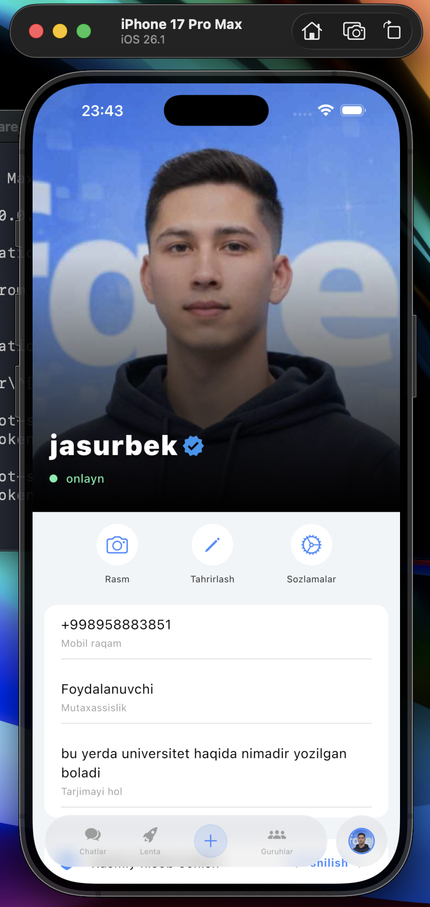
  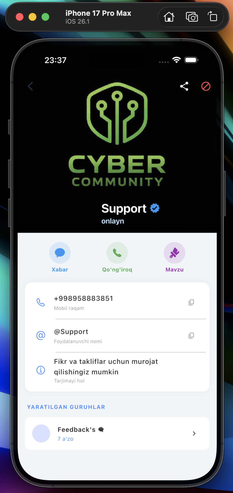
  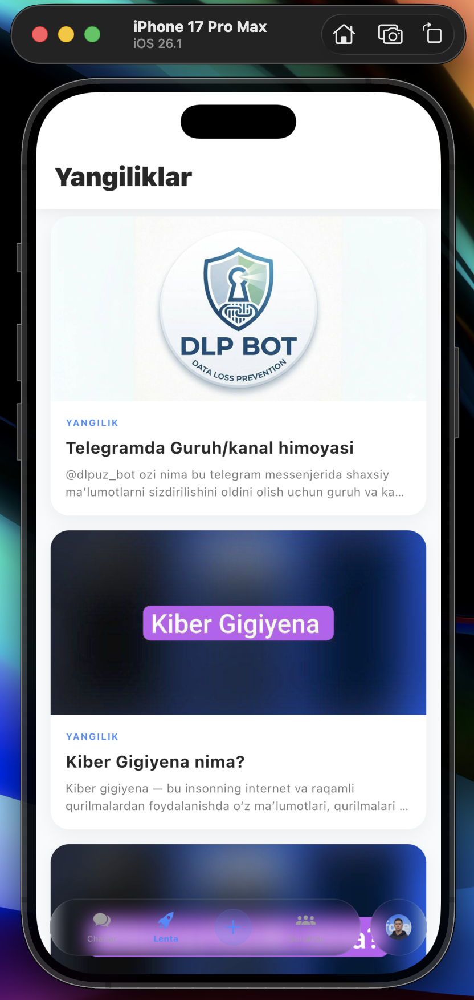
  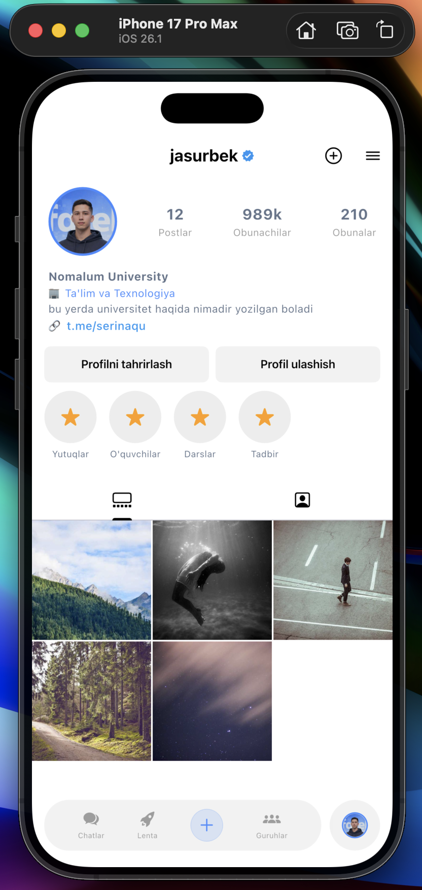
  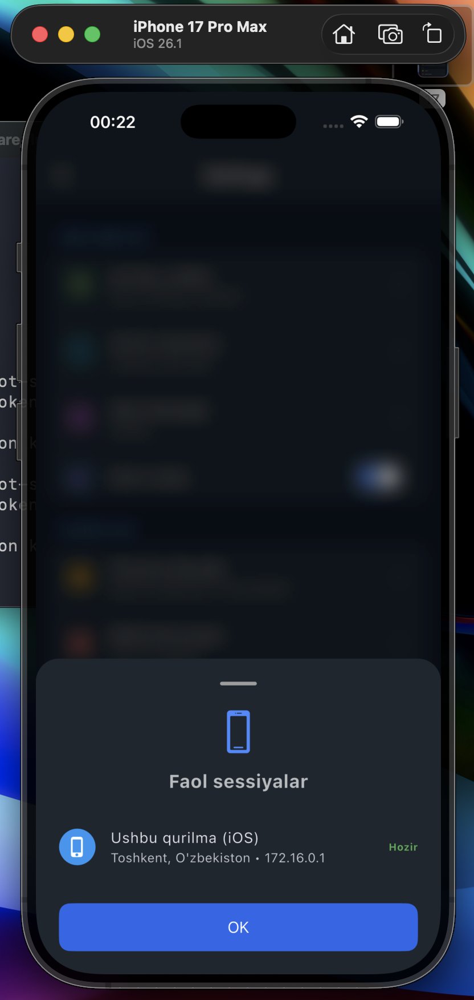

### 💬 Xavfsiz Messenjer va Guruhlar
Shaxsiy chatlar, guruh yaratish va media fayllar almashish.

  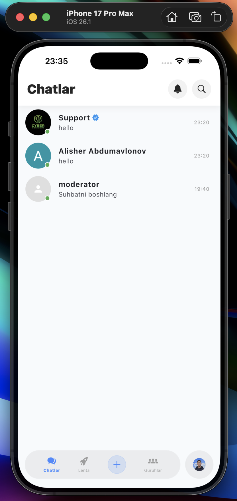
  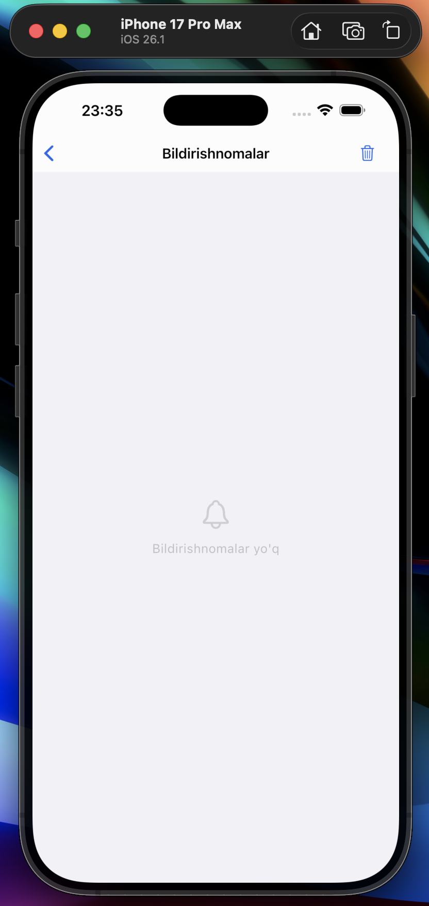
  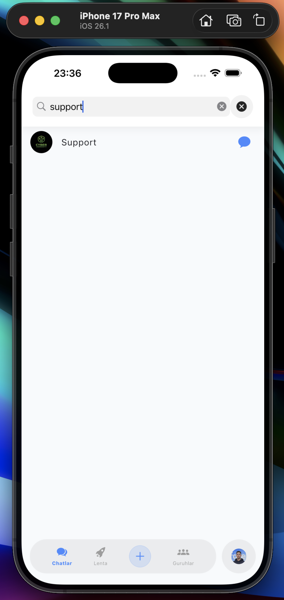
  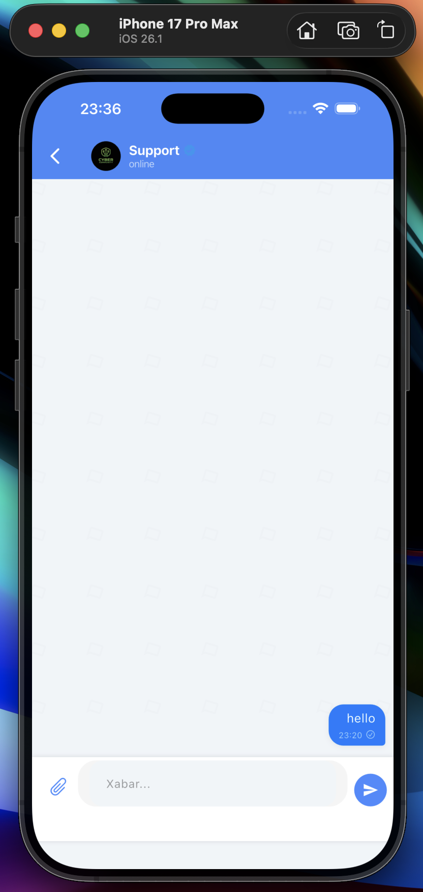
  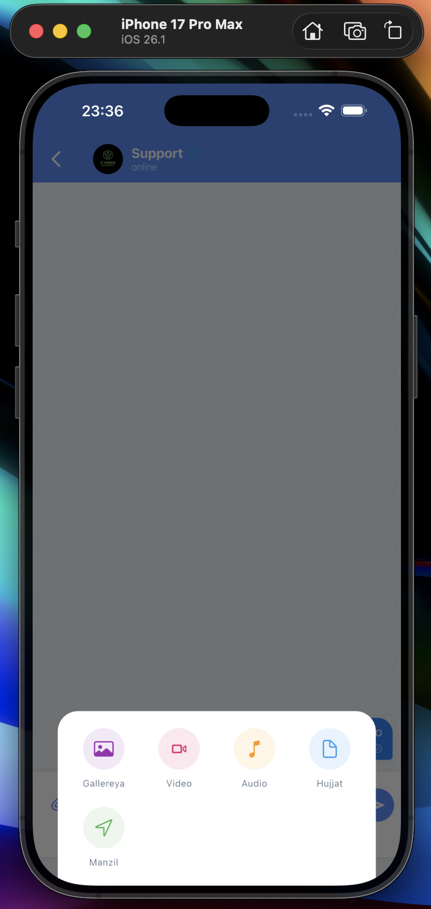
  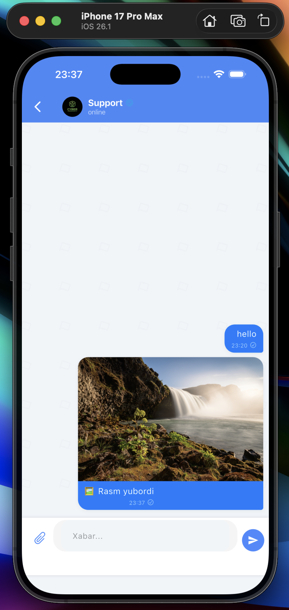

### 📰 Yangiliklar, Lenta va Qidiruv
Kiberxavfsizlik maqolalari va startup loyihalar lentasi.

  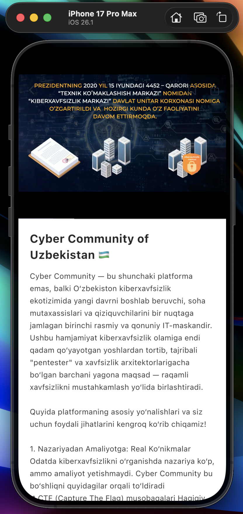
  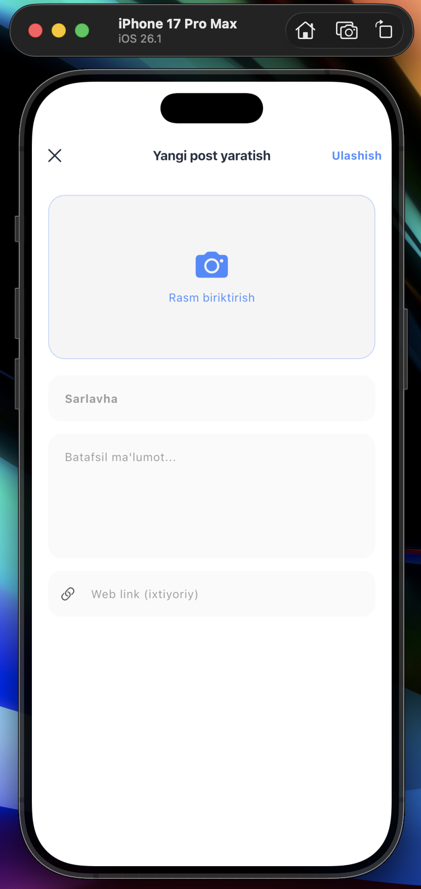
  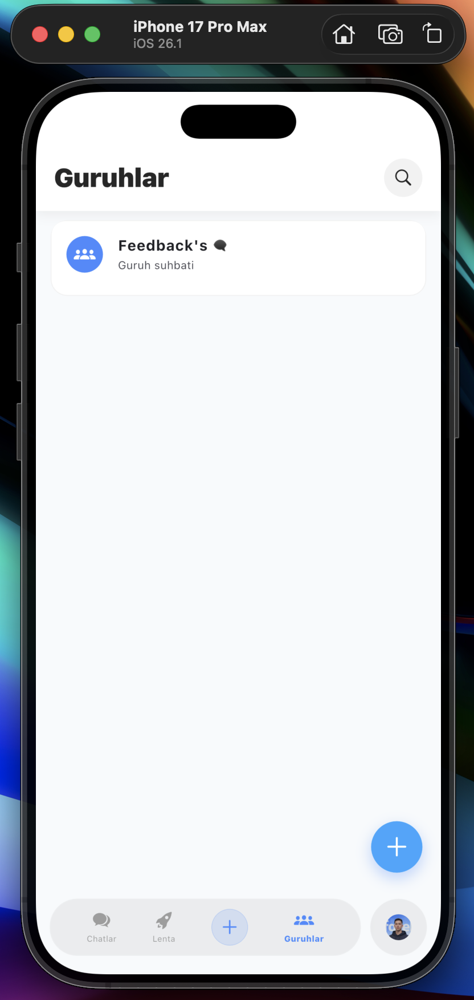
  

### 🛠 Kontent yaratish va Sozlamalar
Yangi post yaratish va xavfsizlik sozlamalari interfeysi.

  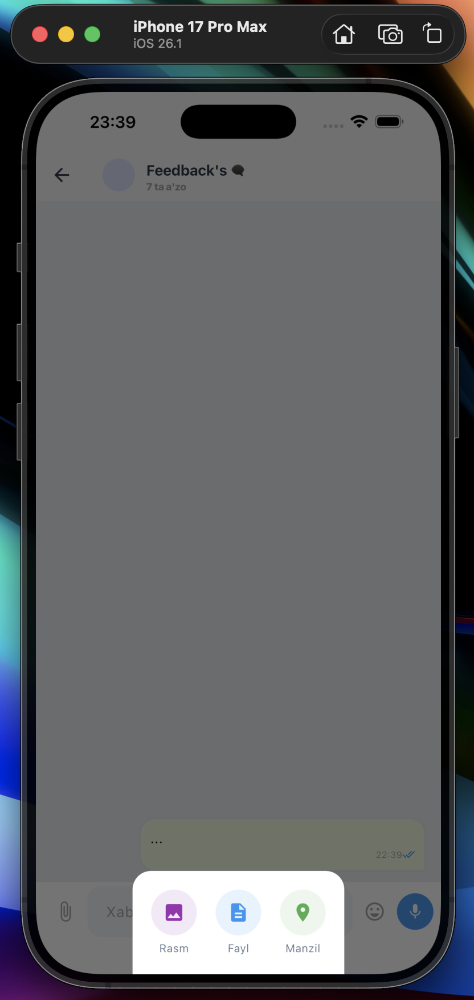
  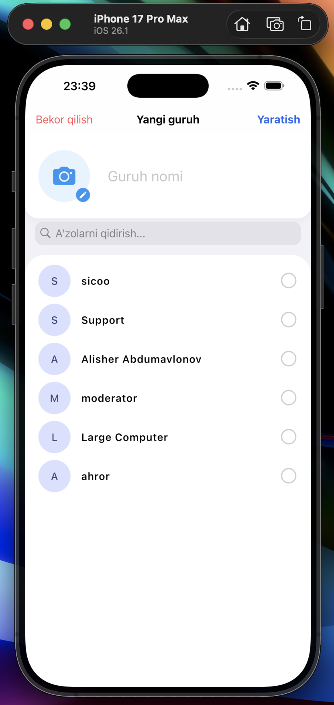
  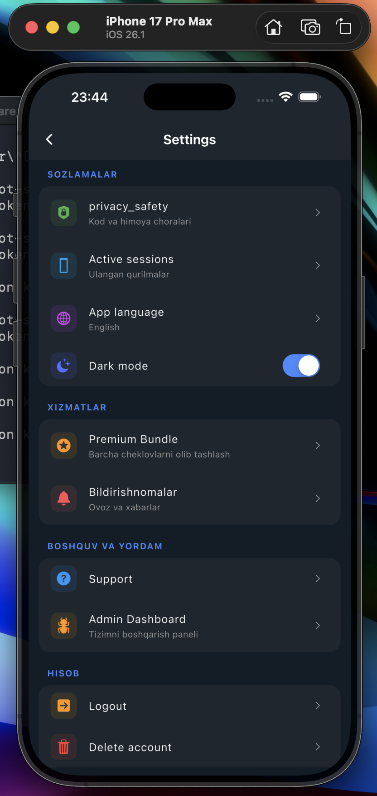
  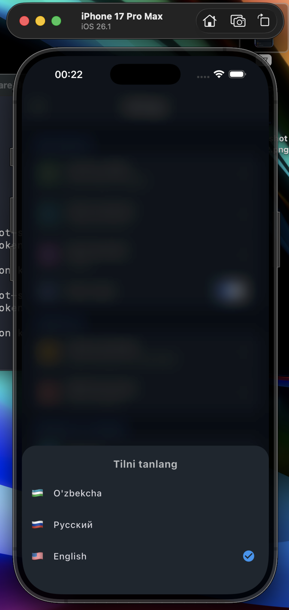

---

## 🚀 Ilovani o'rnatish va sinab ko'rish (MVP)
Ushbu loyihaning tayyor MVP (Proof of Concept) talqinini darhol telefoningizga o'rnatib, real vaqtda sinab ko'rishingiz mumkin.

> 📥 **[Cyber-Startup_MVP.apk (Yuklab olish)](https://t.me/hackerlaruchundasturlar/22)**